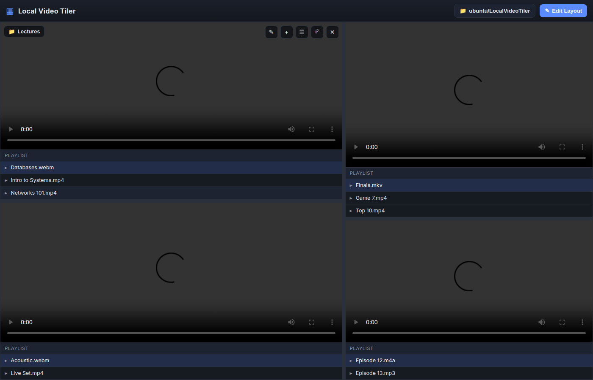

# Local Video Tiler

A local desktop application for **viewing and listening to your downloaded video
files** in a fully customizable, *tiling-window-manager* style layout.

> **New here?** Follow the full walkthrough in **[docs/TUTORIAL.md](docs/TUTORIAL.md)** —
> it covers installation, layout editing, folder organization, and playback step by step.

Split the window into as many panes as you like, point each pane at its own
folder of media, and play/organize everything from one screen. Each tile is
backed by a real folder on disk, so the app doubles as a simple media organizer.



> The app is built with [Electron](https://www.electronjs.org/), runs entirely
> on your machine, and never uploads or phones home. Your videos stay local.

---

## Features

- **Tiling layout** – divide the screen into resizable panes, just like a tiling
  window manager.
- **Edit mode** – tile creation is locked behind an explicit *Edit Layout* mode
  so you never split a pane by accident while watching.
- **Live split preview** – in edit mode, a glowing guide follows your cursor and
  shades the region that the new tile will occupy.
  - **Left click** → split **vertically** (left / right).
  - **Shift + Left click** → split **horizontally** (top / bottom).
  - The split happens exactly where you click, so layouts are highly precise.
- **Drag to resize** – grab any divider to fine-tune the ratio between panes.
- **Folder-backed tiles** – every tile maps to a numbered folder (`display1/tile1`,
  `display1/tile2`, …). Rename a tile to change its on-screen label; the folder
  number stays the same.
- **Hover names** – hover any tile to see its label; folders on disk use `tile#`
  names under `display#`.
- **Per-tile player + playlist** – each tile has its own video/audio player and a
  scrollable playlist of the media in its folder.
- **Focus mode** – the toolbar, tile controls, and player chrome auto-hide after a
  few seconds of inactivity so you see only your videos. Move the mouse or press a
  key to bring controls back.
- **Fullscreen** – press `F11` or click **Fullscreen** for an edge-to-edge video
  wall on your entire display.
- **Multi-display** – run up to **4 independent layouts** at once, one per
  monitor. Assign a saved layout profile to each display. Works alongside
  main-window fullscreen (`F11`).
- **Saved layouts** – create, switch, import, and export named layout profiles.
  Each profile stores your tile splits, names, and video selections.
- **Add media easily** – use a tile's *Add videos* button to copy files into its
  folder, or drop files into the folder directly with your file manager.
- **Persistent** – your layout, tile names, and selected videos are saved and
  restored between sessions.

Supported formats are whatever your system + Chromium can decode, including
`.mp4`, `.m4v`, `.webm`, `.mkv`, `.mov`, `.ogv`, plus audio such as `.mp3`,
`.m4a`, `.flac`, `.wav`, `.opus`, and more.

---

## Getting started

### Prerequisites

- [Node.js](https://nodejs.org/) 18+ (tested on Node 22)

### Install & run

```bash
npm install
npm start
```

That's it — the app window opens with a single tile.

> On Linux you can run it headless for testing with
> `xvfb-run -a npm start -- --no-sandbox`.

---

## How to use it

### 1. Choose where your library lives (optional)

Click **📁 Library…** in the top bar to pick the root folder where tile folders
are created. By default it lives in a `media` folder inside the app's data
directory (e.g. `…/local-video-tiler/media/`). Tile folders are always placed
under `display1/` through `display4/` inside that folder (`display1/tile1`,
`display1/tile2`, …). Changing the library re-binds every tile to fresh numbered
folders under the new root.

### 2. Build your layout (Edit mode)

1. Click **✎ Edit Layout** (or press `Ctrl/Cmd + E`).
2. Move the cursor over any tile — a preview line shows where the split will
   land.
3. **Click** to split into left/right panes, or **Shift + Click** for top/bottom
   panes. The split occurs at the cursor position.
4. Repeat to subdivide any pane as much as you want.
5. Drag the dividers between panes to resize them.
6. Click the red **✕** on a tile to remove it (the empty sibling collapses to
   fill the space). The folder on disk is kept unless you delete it yourself.
7. Click **✓ Done** to leave edit mode and start watching.

### 3. Name your tiles

Each tile has a small toolbar (top-right, visible on hover):

| Button | Action |
| ------ | ------ |
| ✎ | Rename the tile label (folder stays `tile#` on disk) |
| ＋ | Add videos (copies selected files into this tile's folder) |
| ☰ | Show/hide the playlist |
| 🔁 | Lock playback to the current video (off = continuous random shuffle) |
| ⮳ | Open the tile's folder in your OS file manager |
| ✕ | Remove the tile (edit-mode layout action) |

Hover any tile to see its name badge — it shows the tile label you chose.

### 4. Watch & listen

Click **☰** on a tile to open its playlist, then click any item to play it.
Playback **never stops** — when a video ends, another random file from the folder
plays automatically. Use **🔁** to repeat the current file instead of shuffling.
several videos side by side or keep audio going in one pane while watching another.

### 5. Focus on your videos

Stop moving the mouse — after a couple of seconds the toolbar, borders, and
controls fade away, leaving only your videos on a black background. Wiggle the
mouse or press any key to bring everything back.

### 6. Go fullscreen

Press **`F11`** or click **⛶ Fullscreen** in the toolbar for a distraction-free
video wall across your entire screen. Press `F11` again to exit.

### 7. Present on multiple displays

Click **🖥 Displays**, select monitors, assign a **layout** to each, and click
**Present**. Each display runs its own tile grid fullscreen with tile folders
under `{media}/display1/` through `{media}/display4/` as `tile1`, `tile2`, etc.
Even with one monitor, tiles use `display1/` so adding screens later won't
duplicate files. Move the mouse on any display to reveal **✎ Edit Layout**
(`Ctrl/Cmd+E`) and edit that screen’s tiles directly. Press **`Escape`** or click
**Stop** on any presenter to end presentation, or **`Ctrl+Q`** / **Quit** to exit
the app.

### 8. Manage saved layouts

Click **▤ Layouts** to create new layout profiles, switch between saved layouts,
or **Import** / **Export** layout files (`.json`). Click **Save** to persist
changes to the active layout.

---

## How it works

| Area | File |
| ---- | ---- |
| Electron main process, filesystem + IPC | `src/main/main.js` |
| Secure preload bridge (`window.api`) | `src/main/preload.js` |
| UI, rendering, edit mode, players | `src/renderer/renderer.js` |
| Tiling binary-tree model | `src/renderer/tree.js` |
| Markup / styles | `src/renderer/index.html`, `src/renderer/styles.css` |

The layout is a binary tree: every **split** node has two children laid out
either side-by-side (`vertical`) or stacked (`horizontal`), divided at a `ratio`.
Every **leaf** node is a tile bound to a folder. Splitting turns a leaf into a
split node; removing a leaf collapses its sibling upward.

Layout and library configuration are persisted to a `config.json` in Electron's
per-user data directory.

---

## Tests

Automated end-to-end tests drive a real Electron renderer to verify the tiling
logic, folder syncing, and playlist behaviour:

```bash
npm test                 # on a machine with a display
xvfb-run -a npm test     # headless (Linux)
```

---

## License

MIT
